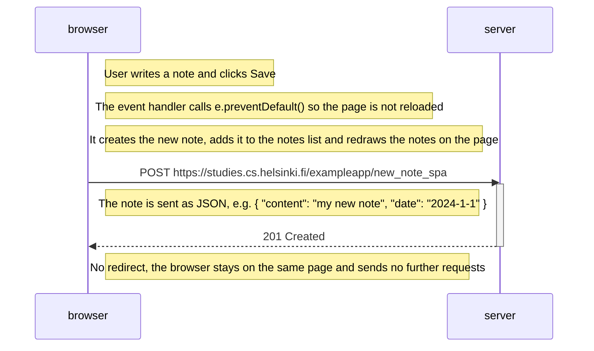

```mermaid
sequenceDiagram
    participant browser
    participant server

    Note right of browser: User writes a note and clicks Save
    Note right of browser: The event handler calls e.preventDefault() so the page is not reloaded
    Note right of browser: It creates the new note, adds it to the notes list and redraws the notes on the page

    browser->>server: POST https://studies.cs.helsinki.fi/exampleapp/new_note_spa
    activate server
    Note right of browser: The note is sent as JSON, e.g. { "content": "my new note", "date": "2024-1-1" }
    server-->>browser: 201 Created
    deactivate server

    Note right of browser: No redirect, the browser stays on the same page and sends no further requests
```
